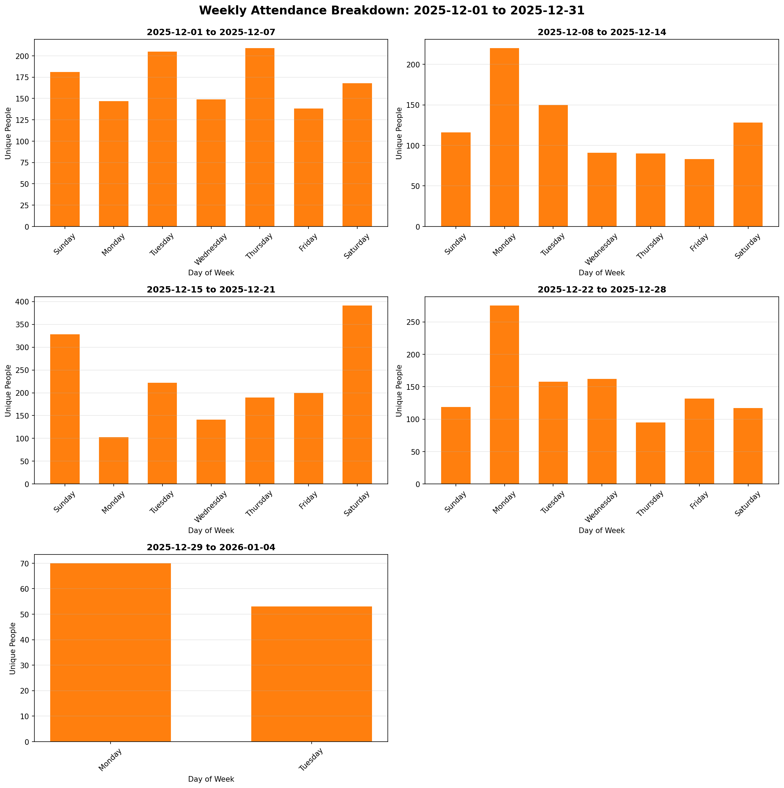

# vrcx-query-tools

Tools and scripts for querying and analyzing VRCX database data, including Python/Node scripts and comprehensive schema documentation.

## Overview

This repository contains tools for analyzing your VRChat activity data stored in VRCX's SQLite database. It provides:

- Python scripts for querying location history, join/leave events, and instance statistics
- Hour-by-hour reports of people in instances
- CSV and Excel export capabilities
- Comprehensive database schema documentation

## Prerequisites

- Python 3.7 or higher
- VRCX installed and running (or access to VRCX.sqlite3 database file)
- Windows, Linux, or macOS

## Setup Instructions

### 1. Clone the Repository

```bash
git clone https://github.com/M1XZG/vrcx-query-tools.git
cd vrcx-query-tools
```

### 2. Create Virtual Environment

On Windows (PowerShell):
```powershell
python -m venv venv
.\venv\Scripts\Activate.ps1
```

On Linux/macOS:
```bash
python3 -m venv venv
source venv/bin/activate
```

### 3. Install Dependencies

```bash
pip install -r requirements.txt
```

### 4. Configure Environment Variables

Create a `.env` file in the project root (already created if you followed setup):

```ini
# Path to your VRCX data directory
VRCX_DATA_PATH=C:\Users\YourUsername\AppData\Roaming\VRCX

# Database file name (default: VRCX.sqlite3)
VRCX_DB_FILE=VRCX.sqlite3

# Output directory for reports and exports (default: ./vrcx_exports)
# You can set this to any absolute or relative path where you want reports saved
VRCX_REPORTS_OUTPUT_PATH=./vrcx_exports
```

**Important:** The `.env` file contains your local paths and is excluded from git via `.gitignore`.

### 5. Verify VRCX Database Location

The default VRCX database locations are:
- **Windows:** `C:\Users\<Username>\AppData\Roaming\VRCX\VRCX.sqlite3`
- **Linux:** `~/.config/VRCX/VRCX.sqlite3`
- **macOS:** `~/Library/Application Support/VRCX/VRCX.sqlite3`

The script will automatically try to locate your database, but you can specify a custom path using the `VRCX_DATABASE_PATH` environment variable.

## Usage

### Running the Python Query Script

#### Basic Usage (Query Today)

```bash
python vrcx_query.py
```

This will connect to your VRCX database and display today's hour-by-hour attendance summary, exporting to CSV and Excel files.

#### Query Specific Dates

```bash
# Query a specific date
python vrcx_query.py --date 2025-12-25
```

#### Query Date Range (Daily Breakdown)

Get hour-by-hour attendance for each day in a range:

```bash
# Show every day in December with hourly breakdown
python vrcx_query.py --start-date 2025-12-01 --end-date 2025-12-31

# Query a specific week
python vrcx_query.py --start-date 2025-12-20 --end-date 2025-12-27
```

This displays Date, Hour, and Number of People for each hour of each day in the range.

#### Calculate Average Attendance

Get average attendance by hour across a date range:

```bash
# Average for a date range
python vrcx_query.py --start-date 2025-12-20 --end-date 2025-12-30 --average

# Average for just one day
python vrcx_query.py --date 2025-12-25 --average
```

This shows the average number of people joining/leaving at each hour, useful for understanding patterns.

#### Analyze Attendance by Day of Week

Get average attendance by day of week (Sunday-Saturday) across a date range:

```bash
# Average attendance for each day of the week (generates chart)
python vrcx_query.py --start-date 2025-12-01 --end-date 2025-12-31 --day-of-week

# Also export to CSV and Excel
python vrcx_query.py --start-date 2025-12-01 --end-date 2025-12-31 --day-of-week --export-data
```

This shows which days of the week have the highest average attendance, helping you identify the best days to visit. A chart is always generated and saved as a PNG image.

#### Weekly Breakdown by Day of Week

Get attendance for each day of the week, broken down week-by-week across a date range:

```bash
# Week-by-week breakdown for December (generates charts automatically)
python vrcx_query.py --start-date 2025-12-01 --end-date 2025-12-31 --weekly

# Also export data to CSV and Excel
python vrcx_query.py --start-date 2025-12-01 --end-date 2025-12-31 --weekly --export-data
```

This creates a report showing each week's attendance by day (Sunday through Saturday). Charts are automatically generated:
- A separate bar chart for each individual week
- A combined chart showing all weeks together in a single image for easy comparison

**Example Combined Weekly Chart:**



The combined chart above shows 5 weeks of December attendance data with all weeks displayed in a 2-column grid layout, making it easy to compare patterns across the entire month at a glance and identify which weeks had the busiest days.

#### Unique Visitors Mode

Count each visitor only once per day, ignoring multiple join/leave events:

```bash
# Get unique visitor count for a specific date
python vrcx_query.py --date 2025-12-25 --unique

# Average unique visitors per hour across a date range
python vrcx_query.py --start-date 2025-12-20 --end-date 2025-12-30 --average --unique

# Unique visitors by day of week
python vrcx_query.py --start-date 2025-12-01 --end-date 2025-12-31 --day-of-week --unique

# Week-by-week unique visitor breakdown
python vrcx_query.py --start-date 2025-12-01 --end-date 2025-12-31 --weekly --unique
```

The `--unique` flag is useful for understanding visitor traffic instead of total join/leave events. When enabled, each person is counted only once per day, regardless of how many times they joined or left the instance.

**Example:** If a user joins at 10 AM, leaves at 11 AM, and rejoins at 2 PM, they'll be counted as 1 unique visitor for the day instead of 2.

#### Additional Options

```bash
# Export data to CSV and Excel (charts are always generated)
python vrcx_query.py --date 2025-12-25 --export-data

# Generate charts without exporting data files (faster)
python vrcx_query.py --start-date 2025-12-20 --end-date 2025-12-30 --average

# Combine options
python vrcx_query.py --start-date 2025-12-20 --end-date 2025-12-30 --average --export-data

# Unique visitors with chart (data export optional)
python vrcx_query.py --start-date 2025-12-01 --end-date 2025-12-31 --day-of-week --unique
python vrcx_query.py --start-date 2025-12-01 --end-date 2025-12-31 --day-of-week --unique --export-data

# Show verbose database information
python vrcx_query.py --start-date 2025-12-01 --end-date 2025-12-31 --day-of-week --verbose
```

**Note:** Charts (PNG images) are generated for all queries by default. Use `--export-data` to also save CSV and Excel files.

### Command-Line Options

| Option | Description |
| ------ | ----------- |
| `--date YYYY-MM-DD` | Query a specific date |
| `--start-date YYYY-MM-DD` | Start date for range query |
| `--end-date YYYY-MM-DD` | End date for range query |
| `--average` | Calculate average attendance across date range (hourly) |
| `--day-of-week` | Show average attendance by day of week (Sunday-Saturday) |
| `--weekly` | Show week-by-week breakdown with day-of-week attendance |
| `--unique` | Count unique visitors only once per day (ignores multiple join/leave events) |
| `--export-data` | Export data to CSV and Excel files (charts always generated) |
| `--verbose` | Show verbose output including database table information |

### Available Query Functions

The `VRCXQuery` class provides several methods:

- `get_location_history(date_str)` - Your instance visits for a date
- `get_join_leave_events(location, date_str)` - Who joined/left instances
- `get_hour_by_hour_summary(date_str)` - Hourly statistics for a specific date
- `get_hour_by_hour_average(start_date_str, end_date_str)` - Average attendance across a date range
- `get_people_in_instances_by_hour(date_str)` - Detailed breakdown
- `get_instance_statistics(date_str)` - Instance visit stats

### Export Formats

The script exports data in multiple formats:

**Data Files:**

- **CSV:**
  - Single date: `vrcx_exports/vrcx_hourly_YYYY-MM-DD.csv`
  - Date range: `vrcx_exports/vrcx_daily_YYYY-MM-DD_to_YYYY-MM-DD.csv`
  - Average: `vrcx_exports/vrcx_average_YYYY-MM-DD_to_YYYY-MM-DD.csv`
  - Day of week: `vrcx_exports/vrcx_day_of_week_YYYY-MM-DD_to_YYYY-MM-DD.csv`
  - Weekly breakdown: `vrcx_exports/vrcx_weekly_YYYY-MM-DD_to_YYYY-MM-DD.csv`

- **Excel:**
  - Single date: `vrcx_exports/vrcx_hourly_YYYY-MM-DD.xlsx`
  - Date range: `vrcx_exports/vrcx_daily_YYYY-MM-DD_to_YYYY-MM-DD.xlsx`
  - Average: `vrcx_exports/vrcx_average_YYYY-MM-DD_to_YYYY-MM-DD.xlsx`
  - Day of week: `vrcx_exports/vrcx_day_of_week_YYYY-MM-DD_to_YYYY-MM-DD.xlsx`
  - Weekly breakdown: `vrcx_exports/vrcx_weekly_YYYY-MM-DD_to_YYYY-MM-DD.xlsx`

**Charts (generated by default):**

- Average attendance: `vrcx_exports/vrcx_average_YYYY-MM-DD_to_YYYY-MM-DD.png`
- Daily attendance: `vrcx_exports/vrcx_hourly_YYYY-MM-DD.png`
- Day of week: `vrcx_exports/vrcx_day_of_week_YYYY-MM-DD_to_YYYY-MM-DD.png`
- Weekly breakdown:
  - Individual weeks: `vrcx_exports/vrcx_week_YYYY-MM-DD_to_YYYY-MM-DD.png` (one per week)
  - Combined view: `vrcx_exports/vrcx_weekly_YYYY-MM-DD_to_YYYY-MM-DD_combined.png` (all weeks in one image)

## Documentation

Additional documentation in this repository:

- [docs/VRCX_QUERY_GUIDE.md](docs/VRCX_QUERY_GUIDE.md) - Complete query guide
- [docs/DATABASE_SCHEMA_DIAGRAM.md](docs/DATABASE_SCHEMA_DIAGRAM.md) - Database structure
- [docs/DATABASE_STRUCTURE_REVIEW.md](docs/DATABASE_STRUCTURE_REVIEW.md) - Detailed schema analysis
- [docs/README_DATABASE_REVIEW.md](docs/README_DATABASE_REVIEW.md) - Database review documentation
- [docs/vrcx_queries.sql](docs/vrcx_queries.sql) - Raw SQL query examples for direct database access

## Troubleshooting

### Database Not Found

If the script can't find your database:
1. Verify VRCX is installed
2. Check the database path in `.env`
3. Set `VRCX_DATABASE_PATH` environment variable manually

### Permission Errors

Make sure VRCX is closed when running queries, as SQLite may lock the database file.

### Missing Dependencies

If you get import errors:
```bash
pip install -r requirements.txt
```

## Security Notes

- The `.env` file is excluded from git to protect your local paths
- Never commit your actual VRCX database file
- The `.gitignore` file protects sensitive data from being pushed

## Contributing

Feel free to open issues or submit pull requests for improvements.

## License

MIT License - see LICENSE file for details
